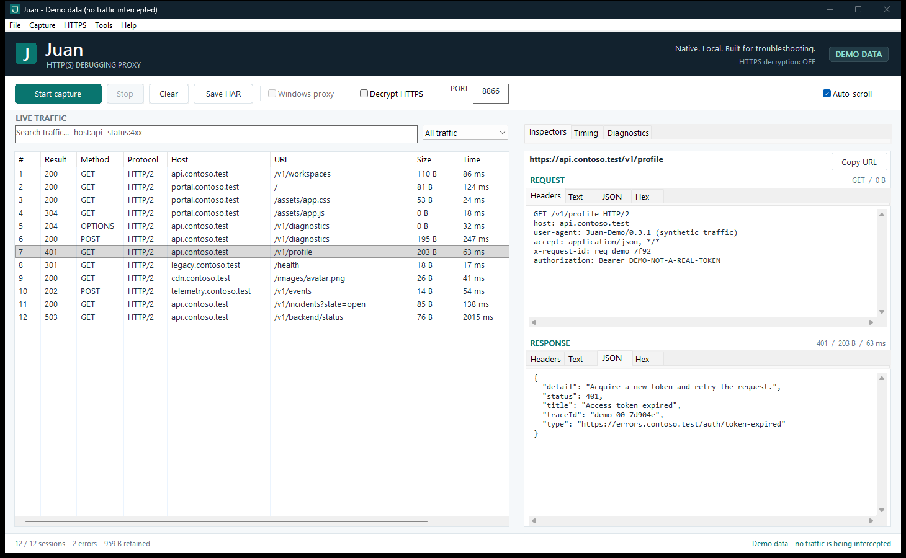

# Juan

**A native Windows HTTP(S) debugging proxy for support engineers.**

Juan combines a classic session-list / inspector workflow with a small Rust
application, native Win32 controls, and explicit capture and trust controls.
There is no webview, embedded browser, account, cloud service, or telemetry.

**Version 0.3.1 is an initial working developer preview, not full Fiddler feature
parity.** It is an independent implementation with original branding and assets,
not affiliated with or endorsed by Fiddler or its owners.



The screenshot uses synthetic `.test` domains and a visibly fake token.

Version 0.3.1 fixes upstream HTTP/2 resets on origins such as Google. Outbound
authority is now generated from the target URI by the HTTP client: `Host` for
HTTP/1.x and `:authority` for HTTP/2, without an extra forwarded `Host` header.
HTTP/2 and upstream certificate verification remain enabled.

Version 0.3.0 renames the project from **Widdler to Juan**, including the desktop,
CLI, Rust crate, assets, and archive producer identifiers.

Version 0.2.0 adds native **SAZ import/export**, offline CLI inspection/conversion,
and a SAZView-compatible HTML index. Binary and compressed body bytes, recorded
timestamps, header values, trailers, session flags, and retention markers are
preserved where available; unknown timing is shown as unknown, not invented.

Version 0.1.2 integrates CA trust into **Decrypt HTTPS** setup. Missing Windows
trust triggers a consent dialog, installation is verified before decryption is
enabled, and cancellation or failure leaves decryption off. An explicit
client-specific trust option remains available.

Version 0.1.1 fixes capture startup: **Start capture** now asks whether to route
Windows traffic or use a manually configured test app. Choosing Windows capture
starts the listener and enables Windows routing together, after that explicit
choice. Version 0.1.0 started only the listener.

## What works

| Area | Included |
| --- | --- |
| Desktop | Native Windows controls, per-monitor DPI awareness, resizable split panes, virtualized session table, sortable/reorderable columns, keyboard shortcuts |
| Capture | Loopback HTTP proxy; encrypted HTTPS CONNECT tunnels by default; optional TLS interception; HTTP/1.1 and HTTP/2 on decrypted connections |
| Fidelity | Streamed uploads/downloads, redirects returned without following them, binary payloads, response trailers, compression preserved on the wire |
| Inspectors | Request/response headers and trailers, UTF-8 text, formatted JSON, original body bytes in Hex, measured timings, diagnostic messages |
| Compression | Bounded gzip, zlib-deflate, and Brotli decoding for inspection and export only |
| Filtering | Text search, host, method, status/range, content type, scheme, errors, negation, and quick scope filters |
| Archives | Native unencrypted SAZ import/export, SAZView-compatible index, and HAR 1.2 export; explicit partial-capture metadata and sensitive-export confirmation |
| Upgrades | HTTP/1.1 WebSocket handshake capture and transparent bidirectional relay; frames are not decoded |
| Windows integration | Explicit current-user proxy routing, saved settings and crash recovery, explicit current-user CA trust/removal |
| Headless | A separate CLI with JSON-line session summaries, timed capture, HAR export, and CA management |

### Lightweight by design

- Native controls, two async worker threads, pooled outbound connections; no UI runtime to install.
- A local x64 release measurement was approximately **5.5 MiB for `juan.exe`**
  and **22 MiB idle working set** with the demo open. This is a measurement, not a
  guarantee for every Windows configuration or workload.
- Default retention is **1,000 sessions, 1 MiB per request/response body, and
  64 MiB of retained body bytes in total**. The oldest sessions are evicted.
  Once a payload budget is exhausted, forwarding continues but body capture
  is truncated and explicitly marked.
- These are retained-payload limits, not a total-process RAM limit. Headers, TLS,
  protocol buffers, JSON previews, and export snapshots need additional memory.
- Text/JSON previews stop at 2 MiB decoded, Hex displays the first 64 KiB, and
  export decoding stops at 8 MiB per body. Decompression is bounded.
- The listener is loopback-only. There are at most 128 connection slots and 256
  in-flight inspected requests. New work beyond the limits receives HTTP 503.

## Run

On Windows 10/11 x64, open `juan.exe` from the portable package. No installation,
administrator rights, separate WebView runtime, or Visual C++ redistributable
is required. The release build statically links the C runtime.

### Upgrading from Widdler

Juan migrates only `root-ca.dpapi` and `proxy-restore.dpapi` from
`%LOCALAPPDATA%\Widdler` to `%LOCALAPPDATA%\Juan` on first use. The protected bytes
are moved intact, not decrypted and reissued; other files in the old folder are
left alone. Conflicting old/new state files stop migration rather than overwrite
either copy. Do not delete CA state while its certificate is still trusted.

Existing CA certificates keep their original **Widdler Local Debugging CA**
subject and fingerprint, preserving previously configured trust. New CAs use
**Juan Local Debugging CA**. The rename itself never installs or removes trust.
Juan and legacy Widdler share an instance guard and cannot capture concurrently.

Old SAZ files with `x-widdler-*` metadata remain readable. New SAZ files use
`x-juan-*`, and new HAR exports use `_juan` metadata. Historical comments and
archive contents are not rewritten simply to remove the old name.

Locally built executables are in:

```text
target\release\juan.exe
target\release\juan-cli.exe
```

The executables are **unsigned**. No signing certificate or publisher identity is
claimed. Windows may show a reputation warning for an unrecognized download.

### First capture

1. Open Juan. It starts **stopped**, with Windows routing and HTTPS decryption off.
2. Leave port `8866`, or choose another free port, then click **Start capture**.
3. Choose **Capture Windows traffic** to start the listener and temporarily route
   proxy-aware Windows apps through it. Or choose **Manual proxy** and configure
   a test app's HTTP and HTTPS proxy to `127.0.0.1:8866` yourself.
4. Reproduce the issue and select a session. Inspect its request, response,
   timing, or diagnostics.
5. Click **Save HAR** to export the currently visible sessions. Stop the proxy
   when finished.

Cancelling the routing choice starts nothing and preserves existing sessions.
Manual mode is labelled **LISTENER ONLY**; starting a listener does not, by
itself, capture browser traffic. The toolbar's **Windows proxy** checkbox can
also enable or disable Windows routing while the listener is running.

A direct application-level example after choosing **Manual proxy**, without
changing Windows settings:

```powershell
curl.exe --proxy http://127.0.0.1:8866 --noproxy "" http://example.com
```

`--noproxy ""` disables curl's environment-configured proxy bypass for this
invocation. Some applications implicitly bypass localhost or use their own proxy
configuration; configure those applications explicitly.

**Pause capture** stops recording new sessions, not forwarding. Already-recorded
in-flight sessions may finish. **Stop** closes the listener and its connections;
retained sessions remain available in the UI. **Clear** removes retained sessions.
Closing Juan discards sessions that have not been exported.

If the table is empty, check the mode badge and filters. **LISTENER ONLY** means
your apps are not automatically routed through Juan. **WIN PROXY ON** means
Windows routing is enabled, but apps that ignore it still need their own proxy
configuration. With HTTPS decryption off, HTTPS connections appear as **CONNECT**
tunnels; enable decryption and configure client trust separately to see the HTTP
requests inside them.

### HTTPS setup and certificate trust

1. Stop the proxy and select **Decrypt HTTPS**.
2. If this CA is not trusted in the Windows user store, Juan shows its
   fingerprint, expiration, and the implications of HTTPS interception.
   Choose **Trust CA and enable HTTPS** to explicitly approve installation.
   Juan verifies trust before enabling decryption. If the CA is already
   trusted, it is reused without another installation prompt.
3. Start capture again and open a new connection in the test application.
4. When finished, stop the proxy and use **HTTPS > Remove local CA trust**.
   Also remove any copies you imported into separate client trust stores.

**Cancel** leaves HTTPS decryption off and does not install trust. Installation
or trust-verification errors also leave decryption off. Installation is limited
to the current Windows user, never the machine store. Turning decryption off or
stopping capture does not remove previously approved trust; the removal action
is explicit. Removing trust through Juan also turns decryption off.

For clients with their own trust store, explicitly choose **Use client-specific
trust** instead. This enables decryption without installing a Windows root:
configure the client first, using **HTTPS > Export public CA**. Until that client
trusts the CA, its certificate errors are expected. The header distinguishes
**Windows CA trusted** from **client trust required**.

For a client-specific CA file (the headless CLI still never installs trust
implicitly):

```powershell
.\juan-cli.exe cert export .\juan-root-ca.pem
curl.exe --proxy http://127.0.0.1:8866 --noproxy "" --cacert .\juan-root-ca.pem https://example.com
```

Firefox normally uses locally installed Windows roots. If it still rejects
Juan after approved installation, search Firefox Settings for **certificates**
and check **Allow Firefox to automatically trust third-party root certificates
you install**, subject to your organization's policy. Restart Firefox after
changing trust. Alternatively, import the exported CA in Firefox's certificate
manager under **Authorities** and approve website identification.
See [Mozilla's certificate-trust guidance](https://support.mozilla.org/en-US/kb/automatically-trust-third-party-certificates).

Do not add `--insecure` or disable upstream certificate verification. Juan uses
the Windows/platform verifier for outbound TLS. Invalid upstream certificates
are rejected and logged, not silently trusted.

Each installation generates a unique CA. The private key is protected with
**current-user Windows DPAPI**, never exported by the UI/CLI or imported into the
certificate store. CA creation does not itself grant trust; installation always
requires your approval.
Roots expire after one year; generated leaf certificates last at most seven days
and are renewed in the bounded certificate cache before expiry. To replace an
expired CA, remove trust and use **Reset local CA**.

### Windows proxy ownership and recovery

Juan saves the previous current-user LAN HTTP/HTTPS proxy settings before
changing them. Existing explicit proxies and PAC scripts are **not overwritten**:
upstream proxy chaining is not implemented. Automatic detection is temporarily
disabled only after the routing confirmation, and its previous state is restored.

The desktop restores its owned settings **before** shutting down the listener.
If restoration fails, the desktop keeps the listener alive and reports the error.
If settings changed outside Juan, it preserves the external change rather than
overwriting it. If those edits still route traffic to Juan (for example, an
edited bypass list), Stop requires manual routing correction rather than leaving
apps pointed at a dead listener. An interrupted run leaves a protected recovery record checked
on the next launch.

Explicit recovery:

```powershell
.\juan-cli.exe proxy restore
```

Recovery only restores a configuration that still matches Juan's installed
settings. If recovery fails, inspect **Windows Settings > Network & internet >
Proxy** and restore the appropriate configuration. Do not blindly disable a
corporate proxy. The CLI reports restoration failures with a nonzero exit status
and retains the recovery record.

Only per-user LAN settings are managed. Machine-wide WinHTTP, VPN/RAS connections,
custom browser settings, and separate application trust stores are not modified.

## Filters and shortcuts

Filters are AND-combined, case-insensitive whitespace-separated terms:

```text
host:api.example.com
method:POST status:4xx
status:400-499 -host:telemetry
type:json scheme:https
error:true
/v1/incidents
```

Supported fields: `host`, `method`, `status`, `type`, `scheme`, and `error`.
Status accepts a code, `1xx` through `5xx`, or an inclusive range.
`error:true` includes proxy failures and HTTP 4xx/5xx responses.
Prefix a term with `-` to negate it. Invalid field expressions are visibly rejected;
they do not silently fall back to unfiltered results. Quoted phrases, regexes,
and arbitrary query expressions are not implemented.

| Shortcut | Action |
| --- | --- |
| Ctrl+O | Open a SAZ archive while the proxy is stopped |
| F12 | Start, pause, or resume capture |
| Shift+F12 | Stop the proxy |
| Ctrl+L | Focus the filter |
| Ctrl+S | Save visible sessions as sanitized HAR |
| Ctrl+Shift+S | Save full HAR after a sensitivity warning |
| Ctrl+Delete | Clear retained sessions |
| Tab / Shift+Tab | Navigate native controls |
| Ctrl+C in an inspector | Copy the native text selection |

## Headless capture

```powershell
# Application-level proxy only; no trust or Windows-routing changes.
.\juan-cli.exe capture --port 8866 --duration 60 --export .\capture.har

# HTTPS interception: configure explicit client trust separately.
.\juan-cli.exe capture --https --port 8866 --export .\capture.har

# Sensitive export and Windows routing are separate explicit opt-ins.
.\juan-cli.exe capture --system-proxy --export .\private.har --full-har

.\juan-cli.exe --help
```

With no duration, Ctrl+C stops capture. Completed session summaries are emitted
as JSON lines on stdout; diagnostics and lifecycle messages go to stderr.
These summaries include request URLs and must be treated as potentially sensitive.
HAR export includes retained sessions only, not already-evicted traffic.

`cert trust`, `cert remove`, and `cert reset` require typed confirmation.
Only one Juan desktop/capturing CLI instance runs per Windows session.

## Fiddler SAZ archives

**Open:** stop the listener, then use **File > Open SAZ** or **Ctrl+O**. You can
also pass a `.saz` filename to `juan.exe`. A successful import replaces retained
sessions after confirmation; cancellation or an invalid archive leaves the
previous sessions intact. Imports run in a background worker. Opening an archive
does not start the listener, change proxy routing, or install certificate trust.

```powershell
.\juan.exe .\customer-capture.saz
.\juan-cli.exe inspect .\customer-capture.saz
```

**Save:** use **File > Save SAZ (sensitive)** for headers and retained body bytes,
or **File > Save sanitized SAZ** to omit bodies and redact common credentials.
Existing **Save HAR / Ctrl+S** behavior is unchanged. Exports include the currently
visible session snapshot.

The CLI selects SAZ for a `.saz` output filename; other output names retain the
previous HAR behavior. CLI exports are sanitized unless `--full` is supplied;
`--full-har` remains an alias.

```powershell
.\juan-cli.exe capture --duration 60 --export .\capture.saz --full
.\juan-cli.exe inspect .\capture.saz --export .\capture.har
.\juan-cli.exe inspect .\capture.saz --export .\copy.saz --full
```

Offline `inspect` can run alongside an active desktop capture. It does not
acquire the capture-instance lock or run proxy recovery.

### SAZ fidelity and limits

- Supports unencrypted ZIP archives using **Stored or Deflate**, including
  bounded ZIP64 directories. Default limits: **256 MiB archive size, 256 MiB
  total declared/consumed expanded data, 32 MiB per entry, 5,000 ZIP entries,
  and 1,000 sessions**. HTTP headers are limited to 64 KiB and session XML
  metadata to 512 KiB. Oversized containers/entries are rejected, not silently
  loaded as partial archives.
- Body retention follows the normal **1 MiB per body / 64 MiB aggregate** budget.
  Excess body bytes are counted but not retained, with explicit partial-capture
  notes. Missing responses and incomplete HTTP bodies are identified.
- Raw request/response files are reconstructed HTTP/1.x messages with consistent
  Content-Length framing, not original TCP packets. Binary and Content-Encoding
  payload bytes are preserved. Chunked input is dechunked; original header
  values, trailers, HTTP/2+ protocol labels, byte totals, and completion state are
  preserved in `x-juan-*` metadata for Juan round-trips.
- `SessionTimers` attributes and `SessionFlags` are retained in full SAZ exports.
  Additional nonempty metadata sections are explicitly noted as unsupported.
  Missing or invalid start/duration information stays unavailable. **HAR export
  requires a recorded start time and duration**; save SAZ instead when either is
  unknown.
- `_index.htm` contains safely escaped values and links understood by SAZView.
  Native import reads raw messages and XML only: it does not render or execute
  imported HTML, scripts, certificate material, or external XML entities.
- Traversal/absolute paths, symlinks, ambiguous duplicate sessions, overlapping
  entries, invalid ZIP directory counts, unsupported encryption, DTDs, and
  malformed XML are rejected. CRC and actual decompression lengths are checked
  when message/metadata entries are read.
- **Not yet supported:** password-protected SAZ, full Fiddler-specific metadata
  round-trips, WebSocket message logs, or HTTP replay. WebSocket handshake records
  can be inspected; message-log entries receive a warning and are not re-exported.

Interoperability checks use synthetic data only. The bundled
`tests\fixtures\fiddler-reference.saz` was generated with Fiddler Classic's
public offline APIs and includes HTTPS, binary/gzip bodies, and HEAD semantics.
Its requests contain only visibly fake credentials and reserved `.test` domains.

## Privacy, fidelity, and current boundaries

Use Juan only for traffic you are authorized to inspect. A trusted debugging
CA is a security-sensitive capability. DPAPI does not protect against another
process already running with your Windows user's privileges.

**Sanitized does not mean anonymized.** The default export omits all bodies and
redacts common credential headers and query parameters, including Authorization,
cookies, tokens, passwords, API keys, Azure Functions keys, APIM subscription keys,
and auxiliary authorization headers. URL paths, hostnames, identifiers, and
unrecognized custom headers may still contain sensitive information. Review before
sharing. Full exports retain credentials and captured body prefixes.

Capture sessions live in process memory unless explicitly exported. Juan's
per-user directory, `%LOCALAPPDATA%\Juan`, contains only the protected CA and
an outstanding proxy-recovery record when needed. Windows paging/crash dumps are
outside the application's persistence controls.

This is an **explicit debugging proxy, not a device-wide packet sniffer**:

- Only apps routed through the proxy are captured. UDP/QUIC/HTTP/3 and traffic
  bypassing the proxy are not captured.
- Certificate pinning and mutual TLS cannot be decrypted by this version.
  Leave decryption off to relay their HTTPS connections as opaque tunnels.
- NTLM/Negotiate connection-bound authentication is rejected with HTTP 501 during
  HTTP inspection; it must not enter a shared authenticated connection pool.
  Opaque HTTPS tunneling preserves the application's own authentication flow.
- WebSocket frames, HTTP/2 CONNECT/extended CONNECT, upstream proxy chaining,
  process attribution, replay/composer, breakpoints, traffic modification,
  HAR import, and persistent session databases are not implemented.
- HTTP header names/order, framing, and protocol versions can be normalized by
  the HTTP stacks. Hop-by-hop headers are removed and proxy credentials are never
  forwarded to origin servers. Inspectors are reconstructed messages, not raw
  TCP/TLS packets. Informational responses other than upgrades are not recorded.
- Timeouts: 15 seconds to connect/upgrade, 20 seconds for incoming HTTP/1 headers,
  120 seconds for upstream response headers, and 300 seconds of polled body
  inactivity. Slow operations beyond these bounds fail explicitly.
- Timing shows receipt of request headers to upstream response headers, then
  response-body delivery. The first interval includes uploads; the second includes
  client backpressure. DNS/TCP/TLS phases are not individually instrumented.
  Tunnel timings cover the connection lifetime.
- HAR exports identify partial bodies, incomplete sessions, and proxy errors in
  `_capture` / `_juan` extensions. Undecodable compressed bodies retain original
  bytes in `_wireBodyBase64` in full exports. Opaque tunnel payloads are not stored.
  Unknown decoded sizes use `-1`, not the compressed or captured-prefix size.
  Malformed request targets use a reserved `.invalid` placeholder URL and retain
  their original target explicitly in `_juan` metadata.

## Build and validation

Prerequisites: Windows x64, the Rust MSVC toolchain, and Visual Studio Build Tools
with **Desktop development with C++** and a Windows SDK. Build tools are required
to compile, not to run the resulting portable executables.

From the repository root:

```powershell
cargo build --release --locked
.\target\release\juan.exe
.\target\release\juan.exe --demo
```

If Rust is installed but unavailable in the current PowerShell PATH:

```powershell
$env:Path = "$env:USERPROFILE\.cargo\bin;$env:Path"
```

Validation:

```powershell
cargo fmt --all --check
cargo clippy --locked --all-targets -- -D warnings
cargo test --locked --all-targets

# Optional public-origin interoperability regression; requires Internet access.
cargo test --locked --test proxy_flow google_http2_get_through_proxy -- --ignored

# Requires an interactive Windows desktop. Starts only test-owned loopback traffic.
.\scripts\smoke-ui.ps1 -Screenshot .\docs\juan.png
.\scripts\smoke-ui.ps1 -Saz
```

The Rust tests use local fixtures and ephemeral certificates. They do not install
certificate trust or change Windows routing. They exercise HTTP/HTTPS forwarding,
HTTP/2 on both TLS legs, untrusted-certificate rejection, streaming, compression,
body budgets, redirects, trailers, WebSocket relay, filtering, HAR redaction,
DPAPI, and proxy-restoration decisions.

The desktop smoke test exercises real controls, inspectors, filters, the native
Windows/manual routing choice, HTTPS trust guidance, cancellation, explicit
client-specific trust, and manual listener start/pause/resume/stop. It runs with
a process-local temporary data directory and removes its untrusted test CA
afterward; it never reads or replaces your app's CA key file. Windows proxy settings and
both Windows root stores are compared before and after. No actual Windows
routing or certificate trust is installed by the smoke test. Installation
success/failure and already-trusted behavior use isolated test doubles. It rejects an
existing recovery record before launching. It checks release executable size
below 20 MiB and idle working set below 128 MiB; workload memory is not covered
by that idle threshold. Screenshots render only Juan's own synthetic demo window.

The `-Saz` desktop check opens the synthetic reference file offline, checks its
body inspector, uses the native Save SAZ dialog, reads the export back, and checks
that cancelling a sensitive export or the Open SAZ dialog preserves the prior
sessions. Malformed-input and transactional-replacement failures are covered by
the Rust parser/store/CLI tests.

Optional independent interoperability checks (Fiddler Classic is **not** a runtime
dependency of Juan):

```powershell
.\target\release\juan-cli.exe inspect .\tests\fixtures\fiddler-reference.saz --export .\roundtrip.saz --full
powershell.exe -NoProfile -File .\scripts\saz-interop.ps1 -Archive .\roundtrip.saz -ReferenceArchive .\tests\fixtures\fiddler-reference.saz
```

The Fiddler check uses public offline archive APIs, never `Startup`/proxy attachment.
The optional `scripts\verify-sazview.cjs` harness runs the unmodified SAZView loader
and session-link handlers with a supplied local copy of
`ericlaw1979/sazview` at revision `1b8ecb02815fe520298dd5682ba03c078e4177e1`,
including its `third_party\jszip` dependency. It does not execute the archive's HTML
or send captures to a website:

```powershell
node .\scripts\verify-sazview.cjs .\roundtrip.saz C:\path\to\sazview
```

Package a portable ZIP and SHA-256 checksum:

```powershell
.\scripts\package.ps1
```

Artifacts go to `dist`. GitHub Actions is configured to format-check, lint, test,
build, and upload the Windows package. The interactive desktop smoke test is
run locally, not assumed to work on a hosted headless runner.
Packaging remaps local build paths and includes only an explicit file allowlist,
never incidental captures saved alongside the executables.

### Source map

| File | Responsibility |
| --- | --- |
| `src\proxy.rs` | HTTP forwarding, CONNECT/TLS, streaming observers, upgrades, shutdown |
| `src\capture.rs` | Bounded in-memory sessions and diagnostics |
| `src\certificate.rs` | Unique CA material and bounded, expiring leaf-certificate cache |
| `src\filter.rs`, `src\inspect.rs`, `src\har.rs` | Queries, safe previews, and explicit HAR export |
| `src\saz.rs`, `src\archive.rs` | Bounded ZIP/HTTP/XML codec, escaped SAZ index, format dispatch, and atomic archive writes |
| `src\windows\ui.rs`, `src\windows\native.rs` | Native desktop, Win32 resource/clipboard/dialog boundaries |
| `src\windows\system.rs` | DPAPI, exact-certificate trust management, recoverable proxy ownership |
| `src\bin\juan-cli.rs` | Headless capture and explicit operational commands |
| `tests\proxy_flow.rs` | End-to-end local protocol fixtures |
| `tests\saz_archive.rs`, `tests\saz_cli.rs` | Reference-file fidelity, adversarial archives, retention, and offline CLI behavior |

Contributions should preserve opt-in trust/routing, loopback-only binding,
upstream certificate validation, bounded capture, streaming semantics, and
explicit failures. Add a regression test with each protocol behavior change.
Do not attach real captures, credentials, private keys, or customer data to issues.

## Backlog

Delivered and deferred SAZ scope is tracked in [BACKLOG.md](BACKLOG.md).
Deferred items are not implemented features.

## License

Juan's original source and assets are [MIT licensed](LICENSE).
Dependency licenses remain their own. Portable packages include aggregated
Cargo dependency notices and the Rust standard-library copyright report.
Two dependency archives omit their license files; copies from their published
source revisions are retained under `resources\licenses` for packaging.
